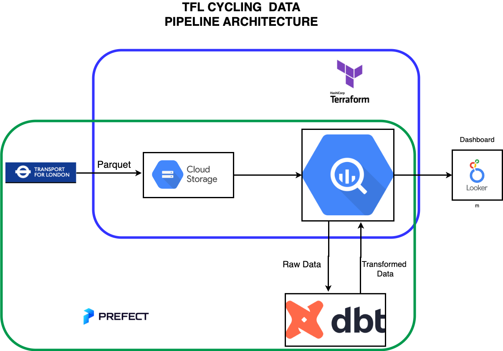
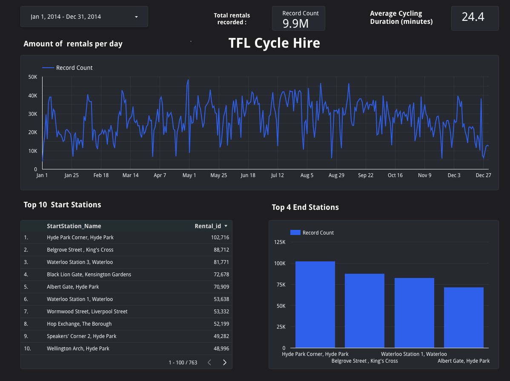

# Transport for London Cycling Data Engineering Project

## Overview
Transport for London (TfL) is the organization responsible for managing and operating London's transportation system, including the London Underground, buses, trams, river services, and taxis. Its mission is to provide a safe, efficient, and sustainable transportation system that connects Londoners to jobs, services, and communities. TfL plans, invests in, manages, and maintains the transport infrastructure in Greater London while regulating and licensing transport services.

This project aims to build an end-to-end orchestrated data pipeline. The pipeline will fetch cycling data from https://cycling.data.tfl.gov.uk and export it to Google Cloud Storage. Then, the data will be filtered, transformed to the desired data types, and uploaded to BigQuery. In BigQuery, DBT will be used to transform the data. Finally, the data will be visualised in a dashboard.

## Questions
1. What is the average cycling duration?
2. What are the top start stations
3. what are the top 4  end stations

## Technologies
- Cloud: `Google Cloud`
- Infrastructure: `Terraform`
- Orchestration: `Prefect`
- Data lake: `Google Cloud Storage`
- Data transformation: `DBT`
- Data warehouse: `BigQuery`
- Data visualization: `Google Looker Studio`

## Architecture

## Dataset

| Column | Description | 
|--------|-------------|
| Rental_id | The rental id in database |
| Bike_id | The rental bike id|
| Start_Date | The start date a bike was rented|
| StartStation_id | The station id a bike was rented  |
| StartStation_Name | The station name a bike was rented |
| End_Date | The date the bike was returned |
| EndStation_id | The station id the bike was returned |
| EndStation_Name | The name of the station the bike was returned |
| Duration | the rental time taken in seconds  |

- Here the dbt lineage graph 

- Partitioned on the `start_date` column as to allow for efficient data filtering based on specific date ranges.
- Clustered on the `startstation_id` column to improve query performance and data locality.

## How to Reproduce ?

Please check the [tutotial](Tutorial.md) to recreate the project

## Dashboard
[Click here](https://lookerstudio.google.com/u/3/reporting/fbadcee0-64bf-4771-8187-960e6ad0f0fa/page/6g7MD) to access my dashboard on Looker.

## Reference

- [divvy-data-pipeline](https://github.com/ETM1123/divvy-data-pipeline.git)

