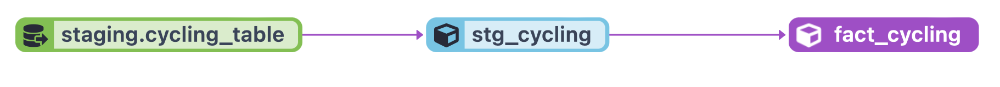

# Tutorial 

## Set up your GCP Environment  
In this section, we cover how to setup our GCP environment using Terraform.

- **Sign up**
  - If you don't already have a Google account, create one. Then, visit [this page](https://cloud.google.com/) and authorize access to the Google Cloud Platform.
  - **Note** that all Google users are eligible for a free $250 credit for three months of usage on their cloud services, but a credit card is required to sign up.
  
- **Create a new project**
  - Steps:
    1. Go to the [Google Cloud Console](https://console.cloud.google.com/) and sign into your account.
    2. In the top navigation bar, select the project drop-down list and click on the "New Project" button.
     3. Enter a unique name for your project and select the billing account that you want to associate with the project.
    4. Select a location for your project. This location determines the default region for your resources. You can change this later if needed.
    5. Click on the "Create" button to create your project.
  - Notes:
    -  Make sure to keep track of your **projectID** and the **location** for your project
    - You can use an existing project but we strongly recommend for everyone to create a new project. If you decide to use an existing project make sure your project has the same exact setup/authorization as us.
    - Once you have created your project, you can access it from the Google Cloud Console by clicking navigational bar and selecting your project. From now on, we are assuming your project is selected.

 - **Create a service account**
    - Steps:
      1. Go to GCP main page
      2. In the left-hand menu, click on "IAM & Admin" and then select "Service accounts".
      3. Click on the "Create Service Account" button at the top of the page.
      4. Enter a name for the service account and an optional description.
      5. Select the Viewer role and click continue and done. 
   - Notes:
      - A service account is a special type of account that is used to authenticate applications and services to access GCP resources programmatically. 
      - In GCP A Viewer role grants read-only access to specific GCP resources.
  
  
 - **Generate SSH key**

[Reference link](https://cloud.google.com/compute/docs/connect/create-ssh-keys)

We need to generate an ssh key, which we'll upload to our Google Cloud project and this will be used for ssh'ing into a VM

On your local computer, open your terminal and run the below command:
`ssh-keygen -t rsa -f ~/.ssh/cycling_vm -C cycling -b 2048`

ssh-keygen -t rsa -f ~/.ssh/KEY_FILENAME -C USERNAME -b 2048

This will generate an 2048 bit rsa ssh keypair, named `cycling_vm` and a comment of `cycling`.  The comment will end up being the user on your VM.

Do a `cat cycling_vm.pub` to see the contents of the public key, and copy the contents.

Back in Google Cloud Console, navigate to Compute Engine > Metadata.

On the SSH keys tab, you can click Add SSH key and paste in the contents you copied, and hit save.

    
  - **Create a VM**

In Google Cloud Console, navigate to Compute Engine > VM instances.  You may have to activate the APi for the Compute Engine when you first come here.

Click the `Create Instance` action towards the top.  On the next screen, you'll want to set the following information:

    * Name = whatever name you would like to call this VM
    * Region, Zone = select a region near you, same with Zone
    * Machine Type = Standard, 4vCPu, 16 GB Memory (e2-standard-4)
    * Boot Disk section, change the following settings:
        * Select Ubuntu and Ubuntu 20.04 LTS (x86/64) as the Operating System and Version
        * Size = 20 GB should be plenty for this project.

Hit Create.  Once the VM is finished getting created, note the external IP address. (if you cant see the externel ip, click the triple dots and select view network details)

In your terminal window, you should now be able to ssh into the VM via the command below, inputing the external IP address of your VM
`ssh -i ~/.ssh/cycling_vm cycling@[external-ip-address]`

You can also update or create a `config` file in your `~/.ssh` folder with the block below, inputing the external IP address of your VM.  This will allow you to just do `ssh gcpvm` to login to your VM

```
Host gcpvm
    Hostname [external IP address]
    User cycling
    IdentityFile ~/.ssh/cycling_vm
```

> **Important note: When you're not using your VM, make sure to stop it in your VM Instances screen in Google Cloud Console.  This way it's not up and running, and using up your credits.**


- **Authenticate local environment to cloud**
  - steps:
    1. Go to GCP main page
    2.  In the left navigation menu, click on "IAM & Admin" and then "Service accounts".
    3. Click on the three verticals dots under the action section for the service name you just created. 
    4. Then click Manage keys, Add key, Create new key. Select JSON option and click Create.
    5. Go to your download folder and find the json file. 
    6. Rename the json file to google_credentials.json
        ```bash
          mv ~/Downloads/<xxxxxx.json> ~/Downloads/google_credentials.json
        ```
    7. Create the following path .google/credentials/ in your HOME directory. You can use the command below in a terminal.
          ```bash
         mkdir -p $HOME/.google/credentials/ 
          ```
    8. Move the google_credentials.json file to the directory above
        ```bash
        mv ~/Downloads/google_credentials.json ~/.google/credentials/ 
        ```
        
        or you can create a new file in $HOME/.google/credentials/ with the name google_credentials.json
        
        - `touch google_credentials.json`
        -  `nano google_credentials.json` and then copy the content of google_credentials.json from download and paste in the newly created json file
        -  `control O` to save the file
        -  `Enter` to confirm
        -  `control X` to close the file
        
        

  ## Fork and clone my github repository
  
  ``` git clone https://github.com/zabull1/cycling_DE_project.git```
  
  
  
  ## install Google Cloud CLI, Terraform and Anaconda
    run `bash ./setup.sh` 
  
  ## Setup your infrastructure with Terraform
- Assuming you are using Linux AMD64 run the following commands to install Terraform - if you are using a different OS please choose the correct version [here](https://developer.hashicorp.com/terraform/downloads) and exchange the download link and zip file name

```bash
sudo apt-get install unzip
cd ~/bin
wget https://releases.hashicorp.com/terraform/1.4.1/terraform_1.4.1_linux_amd64.zip
unzip terraform_1.4.1_linux_amd64.zip
rm terraform_1.4.1_linux_amd64.zip
```
- To initiate, plan and apply the infrastructure, adjust and run the following Terraform commands
```bash
cd terraform/
terraform init
terraform plan -var="project=<your-gcp-project-id>"
terraform apply -var="project=<your-gcp-project-id>"
```
## Setup your orchestration
- sign-up for the prefect cloud and create a workspace [here](https://app.prefect.cloud/auth/login)
- Create the [prefect blocks](https://docs.prefect.io/concepts/blocks/) via the cloud UI
- cd to the prefect folder and create a virtual env and install the required packages
  ```
  python -m venv env
  source env/bin/activate
  pip install -r ../requirements.txt
  ```
- Login in terminal
    ```
    prefect cloud login
    
    ```
- set the workspace
   ```
   prefect cloud workspace set --workspace "email/your_workspace_name"
   
   ```
- goto prefect cloud and deploy the flow on a monthly schedule
- start a perfect agent 
    ```
    prefect agent start --pool default-agent-pool
    ```
- After a successfully run, the data from TFL website will have ingested into GCS we created above, and a table created in BQ

## Step 3: Transform data DBT
In this section, we will utilize DBT Cloud to transform our dataset and generate models that will prepare our data for production. DBT is a Data Building Tool that offers an environment to develop, test, and deploy models. All computations and processes are executed using GCP BigQuery functionality. 
- resources 
  - [dtc-dbt-video](https://www.youtube.com/watch?v=Cs9Od1pcrzM&list=PL3MmuxUbc_hJed7dXYoJw8DoCuVHhGEQb&index=38)
  - [dbt-labs](https://docs.getdbt.com/docs/quickstarts/overview)
- DBT development SET-UP
  - Steps:
    1. If you don't already have a DBT Cloud account, create one at [here](https://cloud.getdbt.com/login/)
    2. Create a new project in DBT Cloud and select "Google BigQuery" as your database type.
    3. Enter the credentials for the service account that you created earlier in this tutorial. You can autofill the credentials section by passing in the JSON file.
    4. Enter the name of the BigQuery dataset that was created in the previous section.
    5. Connect your DBT project to your Git repository. 
    6. Run the following command at the bottom panel
        ```bash
          dbt deps
        ```
    13. Run the command `dbt seed --full-refresh`.

    15. To run the model, use the following dbt command:
        ```dbt 
        dbt run --select +fact_cycling.sql
        ```
        - Note that after execution, all of the models will be accessible in the GCP Big Query service. This will run the model and all of its dependencies.
        
    - If all of the settings are correct, dbt should generate the following lineage for the data models:
      
  16. Once the changes are merged to the main branch, the project is ready to be deployed.

- To deploy a DBT Cloud project, follow these steps:
  1. In GCP BigQuery, create a dataset for production models.
  2. In the DBT Cloud navigator, go to the "Deploy" section and select "Environments."
  3. Click the "Create a new environment" button.
  4. Fill out the form, making sure to select "Production" as the environment type.
  5. Provide the name of the dataset for production models (the one created in step 1) and save the environment.
  6. In the navigator section, go to "Deploy" and select "Jobs."
  7. Click "New Job."
  8. Provide a name for the job and select the production environment created in the previous step.
  9. In the "Command" section, provide the commands you want to execute. If you have multiple models in your cloud repository, you may want to specify the model to run. Otherwise, run these commands: dbt seed, dbt run, dbt test.
  10. In the "Scheduler" section, provide the frequency for the program to deploy.

  After creating a deployment job with dbt cloud, dbt will automatically run your models based on the schedule you provided in the scheduler section. You can use dbt cloud to monitor the status of your models.
  

  <font color='gree'>This concludes our data transformation stage with DBT cloud. We know have a dataset that's ready for production in our Data Warehouse.</font>

## Step 4: Create Visualizations with Looker
- In this section, we'll show how to connect your dataset with Google Data Studio Looker and create a dashboard. Again, we're assuming you have production ready dataset in BigQuery.
- steps:
  - In Data Studio, create a new report and select BigQuery as your data source. Authenticate and connect your BigQuery project to Data Studio.
  - Create a new dashboard in Data Studio: Add charts, tables, and other visualizations to your dashboard using the data from your BigQuery dataset. Customize the layout and style of your dashboard as desired.
    - You can use the following video to design your dashboard: [dashboard-tutorial](https://www.youtube.com/watch?v=nLHypcQymkY)


This tutorial was compiled using below project repos
- https://github.com/ETM1123/divvy-data-pipeline.git
- https://github.com/VincenzoGalante/magic-the-gathering.git
